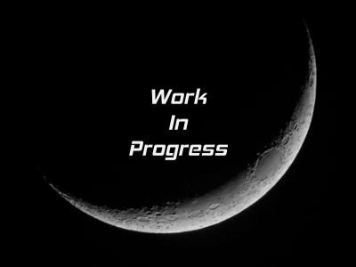

# Technical Guides to CTX

This file will give a list of technical guides that are useful for Admins and Developers.

## Table of Contents

1. Development Machine Setup
1. Virtual Machine Setup with VirtualBox
1. Provisioning a Linux Mint VM
1. Setting up Docker

The [Admin](terms.md 'The primary trainer and onsite mastermind.') is responsible for powering through and creating text